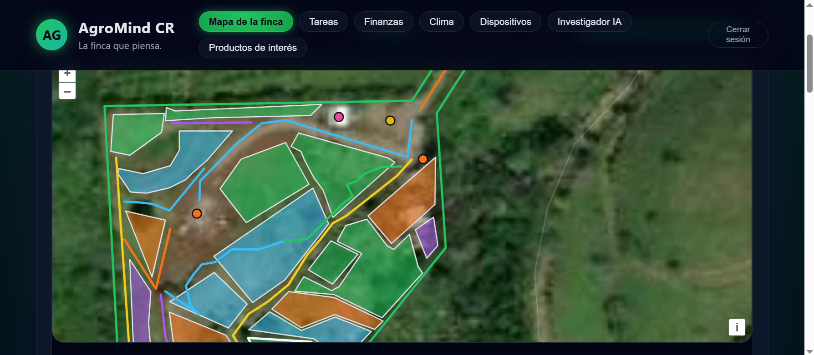
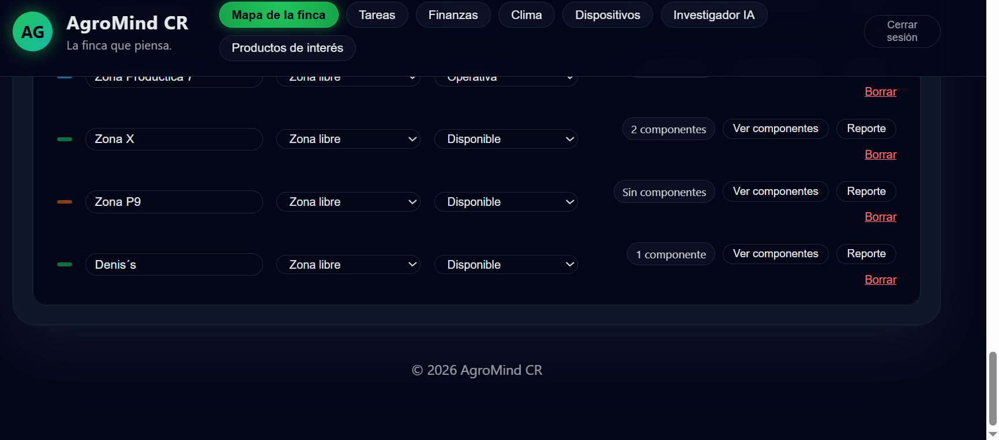
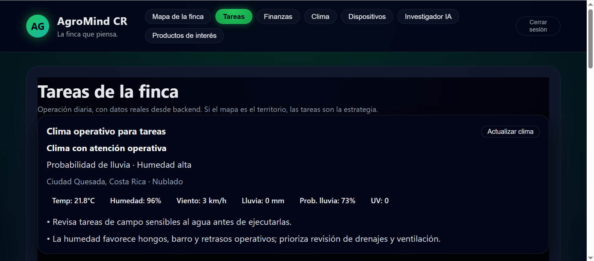
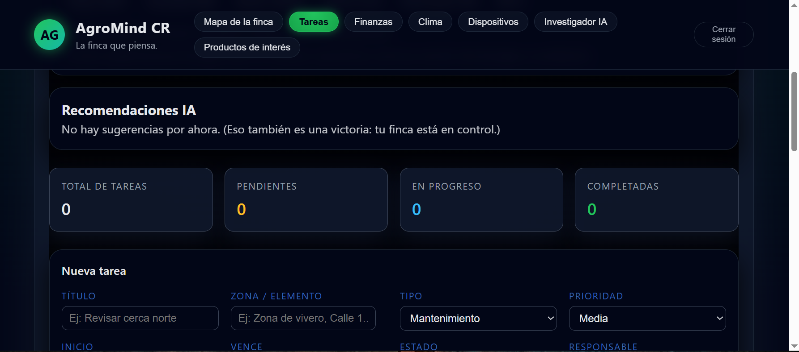
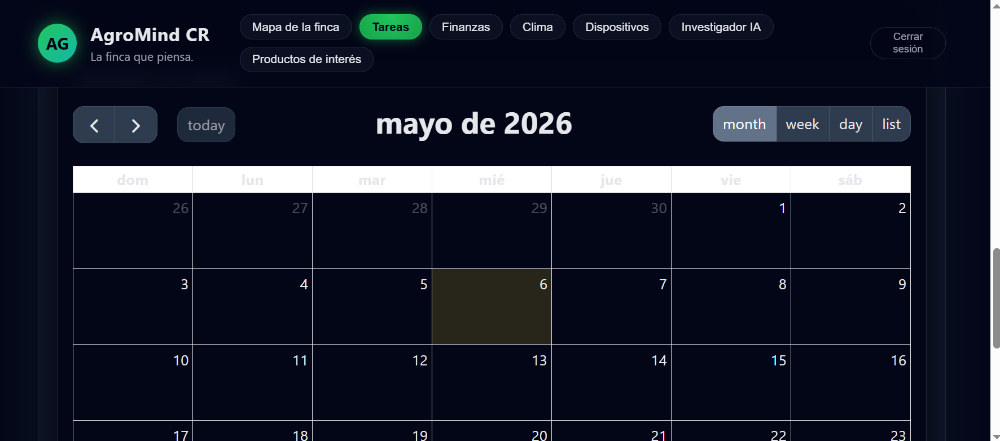
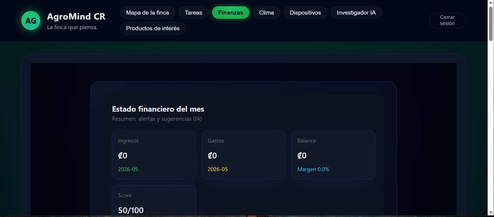
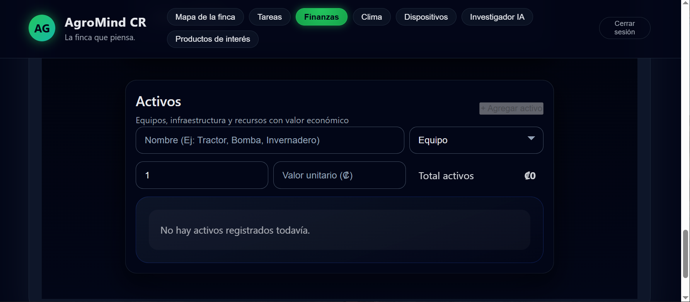
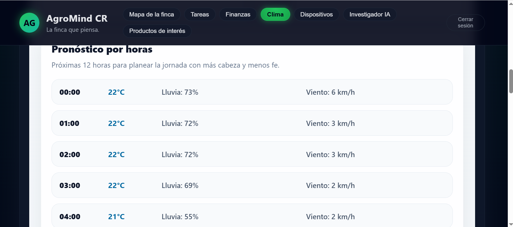
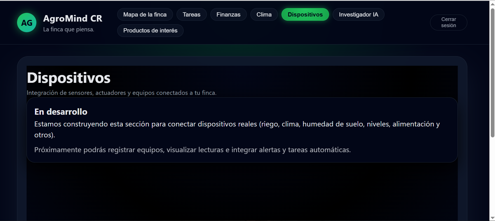

# AgroMind CR Frontend

Frontend de una plataforma enfocada en gestión agrícola, procesos productivos y administración inteligente de fincas.

---

## Funcionalidades

- Gestión de zonas y mapas interactivos
- Administración de tareas y procesos productivos
- Panel financiero
- Integración climática
- Asistencia con inteligencia artificial
- Control e integración futura de dispositivos automáticos
- Arquitectura modular escalable
- Diseño responsive
- Espacios preparados para publicidad y aliados estratégicos del sector agrícola

---

## Tecnologías

- React
- JavaScript
- CSS
- Vite
- MapTiler
- GitHub
- Vercel

---

## Producción

https://www.agromindcr.es

---

## Estado

Proyecto en desarrollo activo con enfoque en automatización agrícola y gestión inteligente de fincas.

## 📸 Screenshots

### Login

### Mapas

### Tareas

### Finanzas

### Clima e IA

### Dispositivos

### Dispositivos

